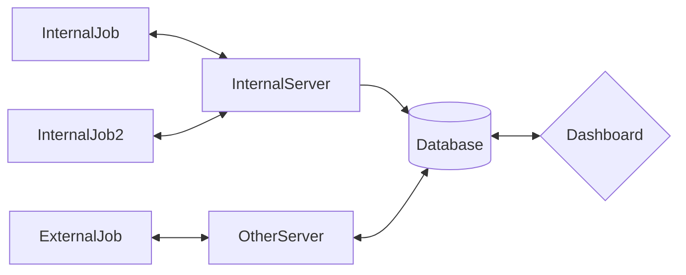

In the realm of software development, task scheduling is a crucial aspect that can significantly impact the performance and efficiency of applications.
In our previous article, we explored the ins and outs of Quartz.NET, a popular task scheduling library. Today, we're going to turn our attention to another powerful player in the .NET ecosystem - Hangfire.

Hangfire is an open-source framework designed to simplify the process of creating, processing, and managing background jobs.
It offers a range of features that make it a robust and versatile tool for handling various types of tasks.
This article will delve into the key components of Hangfire, discuss its benefits, and provide a practical example of how to use it in a .NET Core application.


# Hangfire

- [Hangfire](https://www.hangfire.io/) is an open-source framework that helps you to create, process and manage your
  background jobs.
- There are 4 main parts to Hangfire:
    - Dashboard
    - Server
    - Storage
    - Jobs

## Dashboard - Client

- The Hangfire Dashboard is a web application that allows you to monitor and manage background jobs.
- You can use the dashboard to:
    - View the status of background jobs.
    - View the history of jobs.
    - Retry failed jobs.
    - Delete jobs.

## Database - Storage

Each information about the jobs are stored in a database. Hangfire supports multiple storage options, including:

- SQL Server
- SQL Azure
- MSMQ
- Redis

## Server

- The Hangfire Server is a .NET Core application that processes background jobs.
- Each Server is responsible for processing jobs from a queue.

## Jobs

In Hangfire, a "job" refers to a task or unit of work that needs to be executed.
They are many types of jobs :

- Fire-and-forget jobs
- Delayed jobs
- Recurring jobs
- Continuations
- Batch jobs (Pro version)
- Batch Continuations (Pro version)

In this article we will focus on Fire-and-forget and Recurring jobs.

## Diagram



# Pratical Example

You can't find the source code on the repo.

## Prerequise
- Docker

## Run the project
   - You can run the project directly with docker-compose or DotNet Aspire. I will try to make a future article about DotNet Aspire.


You need a database to store the jobs. You can use SQL Server or SQL Azure.
In this example, we will use SQL Server.

Create a Solution Core application that uses Hangfire to perform background processing.
The project will be devided in 3 parts :

- GoatHangfire.Dashboard (ASP.NET Core Web Application)
- GoatHangfire.InternalJob (Library)
- GoatHangfire.ExternalJob (Worker Application)

## GoatHangfire.ExternalJob

For some reason, you may want to separate the Hangfire Dashboard from the Hangfire Server.

In this case, you can create a new project for the Hangfire Server.
That's why I use the terms External Jobs.

Cons :

- You will not be able to schedule jobs from the dashboard. Only see the status of the jobs.

Pros :

- You can deploy the Hangfire Server on a different server.

### Create the project in solution folder

```shell
 dotnet new worker -o GoatHangfire.ExternalJob
 dotnet add package Hangfire.Core
 dotnet add package Hangfire.NetCore
 dotnet add package Hangfire.SqlServer
 dotnet add package Microsoft.Data.SqlClient
```

In program.cs

```csharp
HostApplicationBuilder builder = Host.CreateApplicationBuilder(args);
builder.Services.AddHostedService<ExternalGoatJob>();

builder.Services.AddHangfire(configuration => configuration
                                              .SetDataCompatibilityLevel(CompatibilityLevel.Version_180)
                                              .UseFilter(new AutomaticRetryAttribute { Attempts = 0, })
                                              .UseSimpleAssemblyNameTypeSerializer()
                                              .UseRecommendedSerializerSettings()
                                              .UseColouredConsoleLogProvider()
                                              .UseSqlServerStorage(
                                                builder.Configuration.GetConnectionString("HangfireDbConnection")));
builder.Services.AddHangfireServer();
```

**AddHangfire**: This method adds Hangfire services to the services container. It takes a configuration action where you
can configure various aspects of Hangfire.

**SetDataCompatibilityLevel**(CompatibilityLevel.Version_180): This sets the compatibility level for serialized data.
Version 180 is the latest and it's recommended to use the latest version unless you need to support older Hangfire
servers.

**UseFilter**(new AutomaticRetryAttribute { Attempts = 0 }): This adds a filter that automatically retries failed jobs.
The Attempts property is set to 0, which means jobs won't be retried if they fail.

**UseSimpleAssemblyNameTypeSerializer**(): This changes the type serializer to use simple assembly names. This can help
avoid issues when moving jobs between different environments.

**UseRecommendedSerializerSettings**(): This applies recommended JSON serializer settings. It's generally a good idea to
use this unless you have specific serialization needs that it doesn't meet.

**UseColouredConsoleLogProvider**(): This adds a log provider that outputs colored logs to the console. This can make it
easier to read and understand the logs.

**UseSqlServerStorage**(builder.Configuration.GetConnectionString("HangfireDbConnection")): This configures Hangfire to
use SQL Server for storage. The connection string is retrieved from the application's configuration with the key "
HangfireDbConnection".

### BackgroundService

We create a new class called ExternalGoatJob that inherits from BackgroundService. This class will be responsible for
adding a recurring job to the Hangfire server every minute.

```csharp
public class ExternalGoatJob : BackgroundService
{
private readonly IRecurringJobManager _recurringJobs;
private readonly IGoatExternalService _goatService;

public ExternalGoatJob(IRecurringJobManager recurringJobs,IGoatExternalService goatService)
  {
    _recurringJobs = recurringJobs;
    _goatService = goatService;
  }
  protected override Task ExecuteAsync(CancellationToken stoppingToken)
  {
    _recurringJobs.AddOrUpdate("ExternalGoatJob",() => _goatService.ExecuteAsync(), Cron.Minutely);
    return Task.CompletedTask;

  }
}
```

We just created a new recurring job called "ExternalGoatJob" that will execute the ExecuteAsync method of the
IGoatExternalService every minute.
The exeternal job can be run directly in you server, you juste need to publish the project then run the executable or
you can create a service.

```shell
sc create GoatHangfire.ExternalJob binPath= "C:\path\to\GoatHangfire.ExternalJob.exe"
sc start GoatHangfire.ExternalJob
```

## GoatHangfire.InternalJob

The project will be directly reference by HangfireDashboard.

Cons :

- You can't deploy the Hangfire Server on a different server.

Pros :

- You can directly schedule jobs from the dashboard.

```shell
dotnet new classlib -o GoatHangfire.InternalJob
dotnet add package Hangfire.Core
```

In this part, we will create several jobs :

Create file InternalGoatJob.cs

```csharp
  public Task ExecuteRecurringJobAsync(string cronExpession,CancellationToken stoppingToken)
  {
    _recurringJobs.AddOrUpdate("internal-goat-recurring-job",
                               ()=>_goatService.RecurringExecuteAsync(stoppingToken), 
                               cronExpession);
    
    return Task.CompletedTask;
  }
```

```csharp
  public Task ExecuteQueueJobAsync(CancellationToken stoppingToken)
  {
    _backgroundJobClient.Enqueue<GoatService>(x => x.ExecuteAsync(stoppingToken));
    return Task.CompletedTask;
  }
```

```csharp
  public Task ExecuteQueueJob(CancellationToken stoppingToken)
  {
    _backgroundJobClient.Enqueue<GoatService>(x => x.Execute(stoppingToken));
    return Task.CompletedTask;
  }
```

Now we need to setup the Hangfire Dashboard.

# GoatHangfire.Dashboard

```shell
 dotnet new worker -o GoatHangfire.Dashboard
 dotnet add package Hangfire
 dotnet add package Hangfire.SqlServer
 dotnet add package Microsoft.Data.SqlClient
```

What I appreciate about Hangfire is the Hangfire Dashboard.
Is a built-in, web-based user interface that allows you to monitor, manage and debug your background jobs.
If you don't set any authorization, the dashboard is accessible only on localhost.

By default, the Hangfire Dashboard is accessible at "/hangfire". You can change this by passing a different route to

```csharp
app.UseHangfireDashboard("/dashboard",
                         new DashboardOptions { Authorization = new[] { new AuthorizationAlwayTrueFilter(), }, });
````

The first argument to `UseHangfireDashboard` is the route where the dashboard will be accessible. In this case, it's "
/dashboard".

The second argument is an instance of `DashboardOptions`. This is where you can specify options for the dashboard. In
this case, an `AuthorizationAlwayTrueFilter` is used, which means the dashboard will be accessible without any
authorization.

You can also set up SSO authentication for the Hangfire Dashboard by using the `AuthorizationSsoFilter` class.

## Authorization

The `AuthorizationAlwayTrueFilter` class is a custom implementation of the `IDashboardAuthorizationFilter` interface.
This class is defined in `AuthorizationAlwayTrueFilter.cs`.

```csharp
public class AuthorizationAlwayTrueFilter : IDashboardAuthorizationFilter
{
    public bool Authorize(DashboardContext context)
    {
        return true;
    }
}
```

## Connection to Hangfire

The Hangfire Dashboard is connected to Hangfire using the `UseSqlServerStorage` method. The connection string is
retrieved from the configuration.

```csharp
.UseSqlServerStorage(builder.Configuration.GetConnectionString("HangfireDbConnection"))
```

The connection string is defined in the `appsettings.json` file under the "ConnectionStrings" section.

```json
"ConnectionStrings": {
    "HangfireDbConnection": "Server=127.0.0.1,1633;Database=hangfire;User=sa;Password=Your_password123;Trusted_Connection=false;Encrypt=false"
}
```

Add Endpoints in order to directly run/update jobs.

```csharp
app.MapPost("/hangfire/create-queue-jobAsync",
             (InternalGoatJob internalGoatJob) =>
            {
               internalGoatJob.ExecuteQueueJobAsync(CancellationToken.None);
            });

app.MapPost("/hangfire/create-queue-job",
            (InternalGoatJob internalGoatJob) =>
            {
              internalGoatJob.ExecuteQueueJob(CancellationToken.None);
            });


app.MapPost("/hangfire/createupdate-recurring-job",
            async (InternalGoatJob internalGoatJob,[FromBody] string cronExpression) =>
            {
              await internalGoatJob.ExecuteRecurringJobAsync( cronExpression,CancellationToken.None);
            });

```

## Accessing the Dashboard

Once the application is running, you can access the Hangfire Dashboard
You can access the dashboard :

- [Swagger](https://localhost:32793/swagger/index.html)
- [Hangfire](https://localhost:32793/dashboard)

Create/Update a Recurring Job with swagger :

 <!-- 
 
  -->


As you can see for external job with have less information than internal job.
Job ==> Could not resolve assembly .....
It's due to the fact that the job is not referenced in the dashboard project.

If you try to requeue external job you will get an error "System.IO.FileNotFoundException: Could not resolve assembly '
GoatHangfire.ExternalJob'."

# Conclusion

In wrapping up our exploration of Hangfire, it's clear that this library offers a comprehensive solution for background processing in .NET Core applications.
Its simplicity and ease of use make it accessible for developers at all levels, while its robust features ensure it can handle even the most complex task scheduling scenarios.

One of the standout features of Hangfire is its Dashboard.
This built-in, web-based user interface provides a clear and detailed overview of all your background jobs, allowing you to monitor, manage, and debug them with ease.
The Dashboard's intuitive design and powerful functionality give Hangfire a significant advantage.

However, like any tool, Hangfire is not without its drawbacks.
One potential downside is that it may require more resources compared to other libraries, as it needs to run its own background process.
This could be a concern for applications with limited resources.
In order to mitigate this issue, developers can consider deploying Hangfire on a separate server or using an external job approach.

Despite these potential cons, Hangfire's ability to handle a wide range of job types, coupled with its user-friendly Dashboard, makes it a valuable addition to any .NET developer's toolkit.
Whether you're working with fire-and-forget jobs, delayed jobs, recurring jobs, or any other type of background task, Hangfire provides the tools you need to manage them efficiently and effectively.

In conclusion, while there are several task scheduling libraries available in the .NET ecosystem, Hangfire's unique blend of simplicity, robustness, and user-friendliness sets it apart.
By understanding its strengths and potential limitations, developers can make an informed decision about whether Hangfire is the right tool for their specific needs.